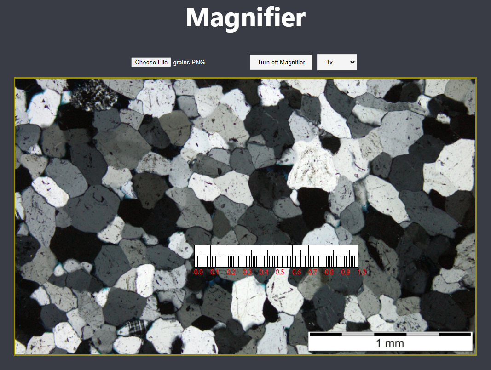

# Magnifier React App

## Introduction

This project is a React-based application that features a magnifier tool for image inspection. It's designed to provide an interactive way to zoom in and examine details within images, with additional functionalities like a dynamic ruler for measuring and a customizable zoom feature.



## Features

- **Magnifier**: Allows users to magnify parts of an image for detailed inspection.
- **Zoom Control**: Users can adjust the zoom level to vary the magnification intensity.
- **Dynamic Ruler**: A floating ruler adjusts according to the zoom level, aiding in precise measurements within the image.
- **Interactive Control**: Use the mouse to control the zoom area and the ruler's position.

## Getting Started

### Prerequisites

Before running the project, make sure you have [Node.js](https://nodejs.org/) installed on your system.

### Installation

1. Clone the repository to your local machine.
   ```
   git clone [repository URL]
   ```
2. Navigate to the project directory.
   ```
   cd [project-directory]
   ```
3. Install the necessary packages.
   ```
   npm install
   ```

### Running the Application

To run the project, follow these steps:

1. Open a terminal or PowerShell in the project directory.
2. Execute the following command:
   ```
   npm start
   ```
3. The application will run in development mode. Open `http://localhost:3000` in your browser to view it.

## Usage

After launching the app, you will see an interface to upload an image. Upon uploading, you can interact with the image in the following ways:

- **Activate Magnifier**: Click the 'Turn on Magnifier' button to enable the magnification tool.
- **Control Zoom Area**: Use the mouse's left button to move the zoomed area over the image.
- **Adjust Ruler Position**: Use the mouse's right button to reposition the scale for measurements.

## Contributing

Contributions to this project are welcome. Please ensure to update tests as appropriate.

## License

[MIT License](LICENSE.md) - Feel free to use and modify this code for your projects.
